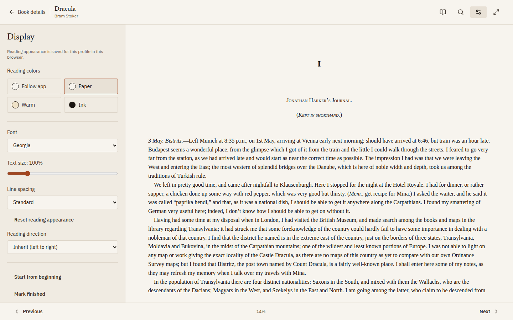

<p align="center">
  
</p>

<p align="center">
  <a href="https://github.com/alexpalexpinne/bokhylle/actions/workflows/ci.yml"></a>
  <a href="LICENSE"></a>
  
</p>

Bokhylle is a self-hosted book library for your household. Keep your EPUB, PDF, and CBZ files in one household collection, choose which books to share, and give each reader a private personal shelf. Discover your next book, read in the browser, or send it to your reading device.

<p align="center">
  <a href="https://demo.bokhylle.com">Try the demo</a> · <a href="#start-with-docker-compose">Install with Docker Compose</a> · <a href="https://bokhylle.com">Visit the website</a>
</p>

<p align="center">
  
</p>

The previews show the isolated demo's selected classics and their covers from [Standard Ebooks](https://standardebooks.org). See the [edition and artwork rights review](demo/RIGHTS.md).

## A library for everyone at home

- **One collection, personal shelves.** Each adult chooses private or shared books, with an account default and controls for individual or selected titles. Personal shelves and reading progress stay private.
- **Discover something you want to read.** Home suggestions draw on your shelf, likes, reading interests, and followed authors. Search the household collection or the public catalogue, and request a missing book.
- **Choose what to download.** Adults who can get books can use Automatic, choose for one book, or always be asked. Get another version keeps existing files and reading progress.
- **Read wherever you prefer.** Open EPUB, PDF, and CBZ in the browser with saved progress. Download a file, send it to an email-capable reader, or connect a reading app through OPDS or KOReader sync.
- **Give children their own shelves.** Adults choose their books and decide whether they can search or explore for more. Children read from their assigned shelves; requests need adult approval. Public catalogue search is not age filtered.
- **Keep a useful catalogue.** Group comics and manga by series and reading order. Review imports and correct book details; your corrections survive later scans and metadata refreshes.
- **Connect an AI assistant.** Use [MCP](#connect-an-assistant-with-mcp) to search books, explore your shelf, and get or send books through a compatible assistant.

<details>
<summary>See the library and browser reader</summary>

<p align="center">
  
</p>

<p align="center">
  
</p>

<p align="center">
  
  
</p>

</details>

<details>
<summary>See the version chooser</summary>

The chooser below uses fictional books and releases.

<p align="center">
  
</p>

</details>

## Start with your books

Place books in your library directory and scan them, or use a watch folder for new files. Bokhylle runs as one Rust server serving the web app, with SQLite for the catalogue and user state. Your book files stay in the configured library directory.

You can add sources and readers as you need them: direct download links, OPDS catalogues, email delivery, or optional torrent and Usenet services. Setup and supported connections are covered in [Getting started](docs/getting-started.md).

The [public demo](https://demo.bokhylle.com) lets you try adult and child views with 26 selected classics, without creating an account. Reading and shelves work with the prepared books; acquisition and delivery are simulated. Visitor changes are temporary. You can also [run the demo locally](demo/README.md).

## Connect an assistant with MCP

Bokhylle supports the **Model Context Protocol (MCP)**, so a compatible AI assistant can work with your library. Ask it to find a book, show your shelf, or check what you have started reading. With write access, it can also get or request books and send an available book to your configured reader.

Each connection uses a token tied to one profile. Choose read-only or read & write access; that profile's permissions and child access rules still apply. See [assistant setup](docs/getting-started.md#connect-an-assistant-with-mcp) to create a token and connect your client.

## Start with Docker Compose

You need Docker with the Compose plugin and a Unix-style shell. Start with a fresh config directory; existing book files can be scanned into it. To start a new installation:

```sh
git clone https://github.com/alexpalexpinne/bokhylle.git
cd bokhylle
cp .env.example .env
mkdir -p data/config data/library data/downloads
printf '\nBOKHYLLE_UID=%s\nBOKHYLLE_GID=%s\n' "$(id -u)" "$(id -g)" >> .env
chmod 600 .env
chmod 700 data/config
```

Set a unique `BOKHYLLE_ADMIN_PASSWORD` of at least eight characters in `.env`. The first administrator is created only while the database has no users. The commands above use your current non-root user's UID/GID so the container can write the mounted directories. If you use a different owner, set `BOKHYLLE_UID` and `BOKHYLLE_GID` in `.env` to match. The example pins the published image to `v0.2.0`. Then start the app:

```sh
docker compose -f compose.yaml -f compose.image.yaml pull bokhylle
docker compose -f compose.yaml -f compose.image.yaml up -d --no-build bokhylle
```

Open [localhost:8080](http://localhost:8080) on the host, sign in as the administrator, place EPUB, PDF, or CBZ files in `data/library`, and run **Scan library** from Settings → Library. You can add the optional acquisition services later.

The Compose defaults are intended for a trusted local network. For access outside your LAN, use an HTTPS reverse proxy and set `BOKHYLLE_SECURE_COOKIES=true`. See [Getting started](docs/getting-started.md) for volume permissions, integrations, and network setup, and [Operations](docs/operations.md) for backups, restores, and updates. Administrators can use **Settings → Server** to check build and storage health, configure database backups, see available releases, and copy diagnostics. The [documentation index](docs/README.md) links the other guides.

To build from source, use `docker compose up -d --build`. For image updates, follow [the image overlay instructions](docs/operations.md#published-image). Optional Jackett and SABnzbd examples are in [Getting started](docs/getting-started.md#optional-jackett-and-sabnzbd-containers).

## Project status

Bokhylle is a **public beta**. Automated tests cover core library, permission, import, reading, and backup flows. Compatibility with physical readers, external services, browsers beyond Chromium, and more NAS setups still needs hands-on validation. Test a restore with your own config and library before relying on backups. See [current limits](docs/getting-started.md#current-limits).

## Documentation and contributions

The [documentation index](docs/README.md) links setup, reader connections, household profiles, and maintenance guides. Start with [Getting started](docs/getting-started.md) after installation, and [Operations](docs/operations.md) for backups, restores, and updates.

Development requires stable Rust with edition 2024 support, Node.js 24, pnpm 10, and make:

```sh
pnpm -C frontend install --frozen-lockfile
make check
```

See [CONTRIBUTING.md](CONTRIBUTING.md) for development and contribution licensing, [AGENTS.md](AGENTS.md) for architecture and invariants, and the [design principles](docs/design-principles.md) for UI work. The [OpenAPI contract](openapi.json) documents the HTTP API and is also served at `/openapi.json`; [API notes](docs/api.md) cover authentication and generated types. Report vulnerabilities through the [security policy](SECURITY.md).

Bokhylle means *bookshelf* in Norwegian. Its source is licensed under [AGPL-3.0-only](LICENSE), including the network source-availability requirement for modified versions. Contributions use the same license; contributors retain their copyright, with no separate agreement required. Dependencies, fonts, and sample books retain their own terms; see [third-party notices](docs/third-party/README.md) and the [demo rights review](demo/RIGHTS.md).

Copyright © 2026 Bokhylle contributors.
