<p align="center">
  
</p>

<p align="center">
  <a href="https://github.com/alexpalexpinne/bokhylle/actions/workflows/ci.yml"></a>
  <a href="LICENSE"></a>
  
</p>

Bokhylle is a self-hosted library for a household's EPUB, PDF, and CBZ books. It keeps one shared collection while each person has their own shelf. Readers can discover titles, request books, and get files onto their devices. The name means *bookshelf* in Norwegian.

[Install it with Docker Compose](#start-with-docker-compose), [run the sample demo locally](demo/README.md), or browse the [website source](website/). The demo uses sample books and runs separately from a household installation.

<p align="center">
  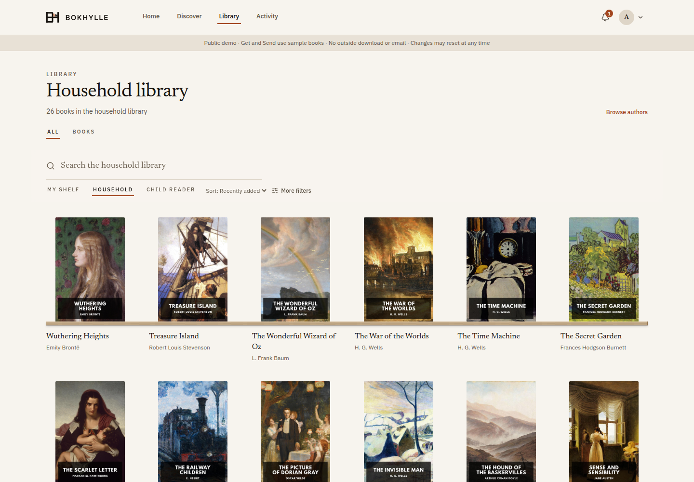
</p>
<p align="center"><sub>Current Bokhylle UI with fictional books created for these screenshots.</sub></p>

## What it does

- **Shared books, private shelves.** Keep one collection of files while each adult chooses books for a shelf only they can browse. New acquisitions enter the shared collection once; they do not appear on every shelf.
- **Comics and manga by series.** Browse grouped volumes in reading order, mark them finished, and find the next volume on your shelf.
- **Review imports together.** Administrators can review suggested publication types and series, preview changes, and accept or dismiss a batch. Corrections stay in place after rescanning.
- **Child profiles.** Children see only books an administrator assigns to them. An administrator can separately enable catalogue discovery, which is not age-filtered, and requests that need approval.
- **Household sign-in.** Pick a profile picture or name, then enter a PIN or password. A username form remains available when needed.
- **Discovery and requests.** Search titles, follow authors, request missing books, and track each request.
- **Several ways to add books.** Import local files through a scan or watch folder, browse OPDS catalogues, or acquire a direct download. Optional torrent and Usenet services fit the same import workflow.
- **Read in the browser or on your devices.** Open EPUB, PDF, and CBZ with saved progress and format-specific reading controls. Download a file, send it to an email-capable reader, or connect through OPDS and KOReader sync.
- **Recovery and backups.** Imports verify files before placement, unfinished acquisitions can resume, and SQLite backups run on a schedule.

<details>
<summary>Household sign-in preview</summary>

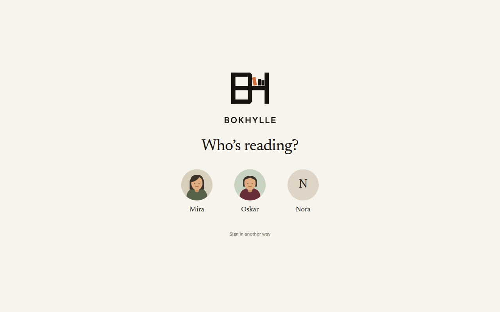

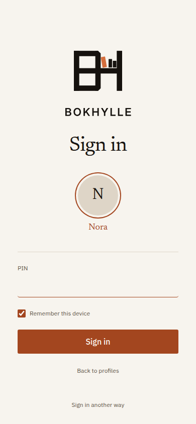

</details>

<details>
<summary>Comics &amp; Manga preview</summary>

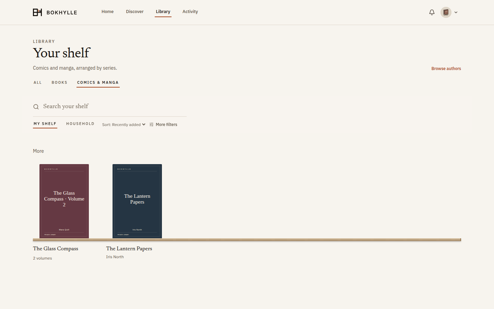

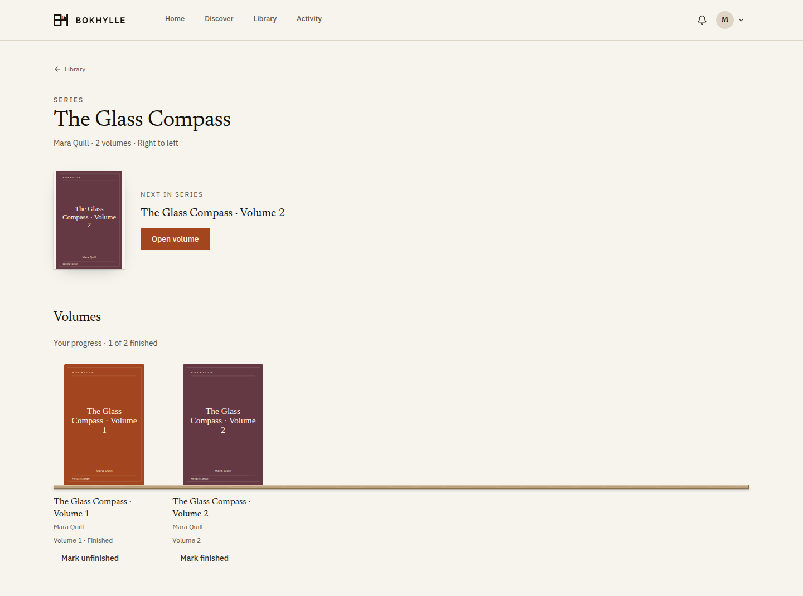

</details>

<details>
<summary>Mobile library preview</summary>

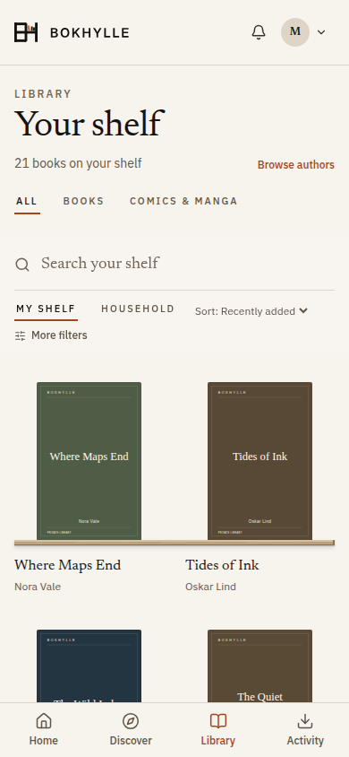

</details>

<details>
<summary>Import review preview</summary>

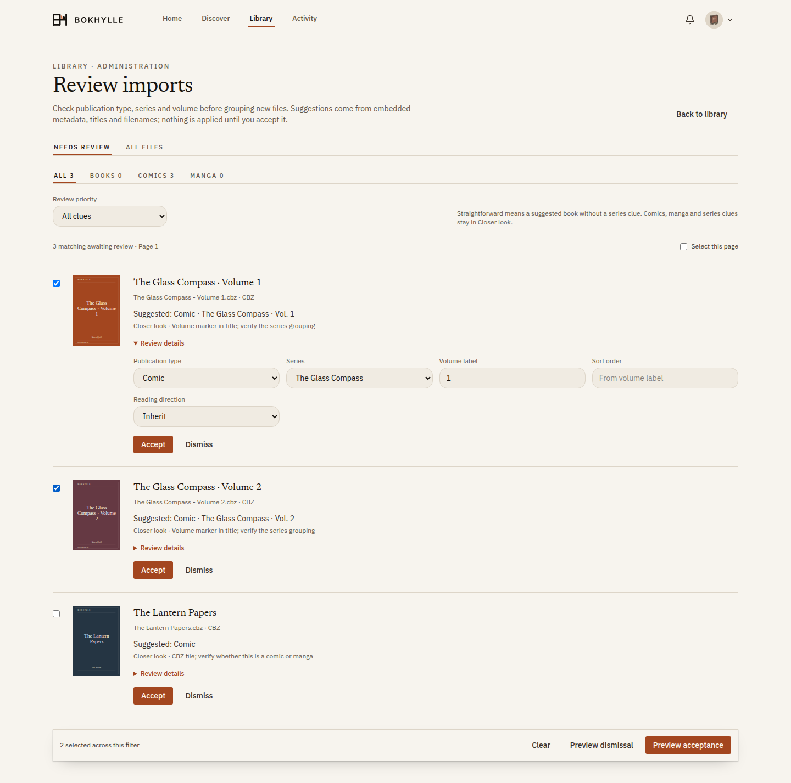

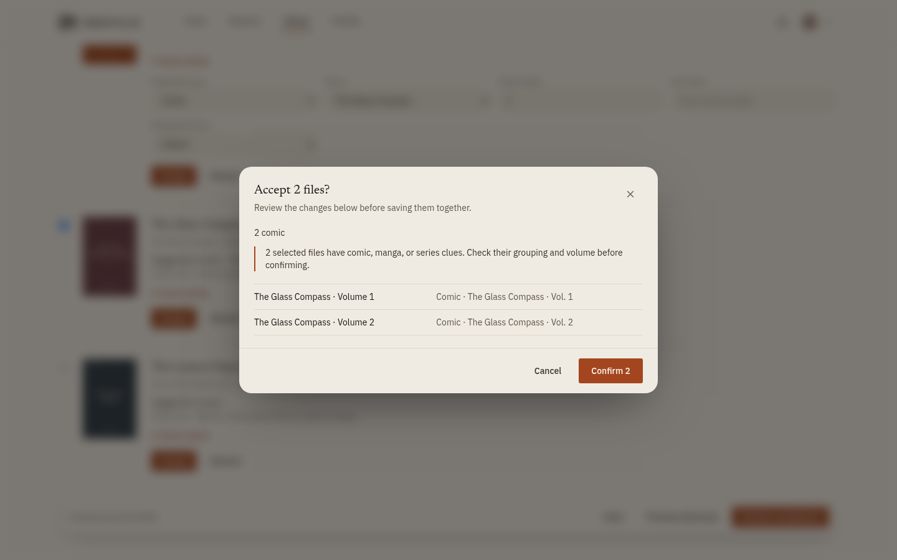

</details>

<details>
<summary>Browser reader preview</summary>

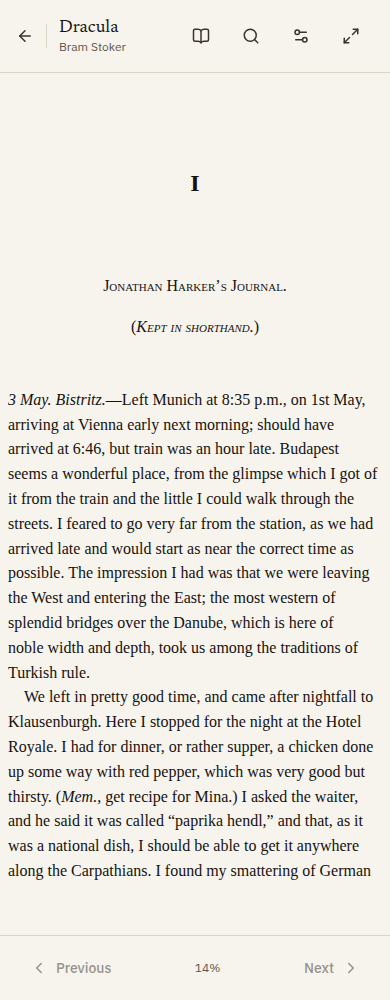

</details>

<details>
<summary>Book catalogues and acquisition settings</summary>

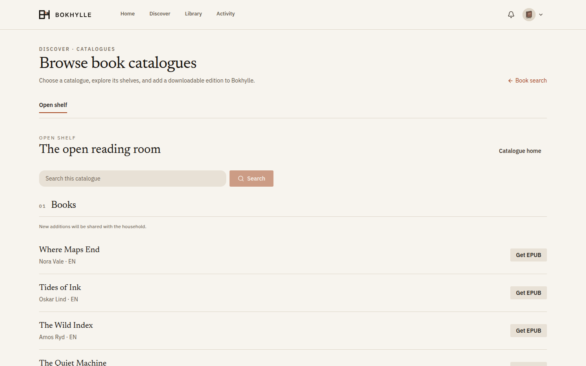

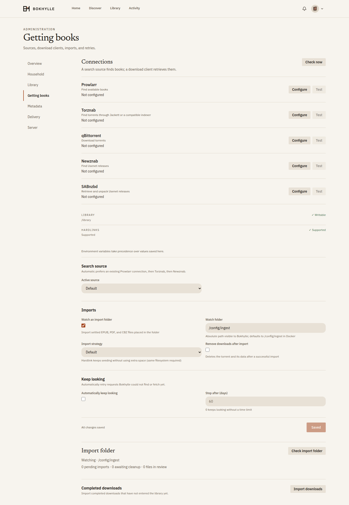

</details>

<details>
<summary>Home preview</summary>

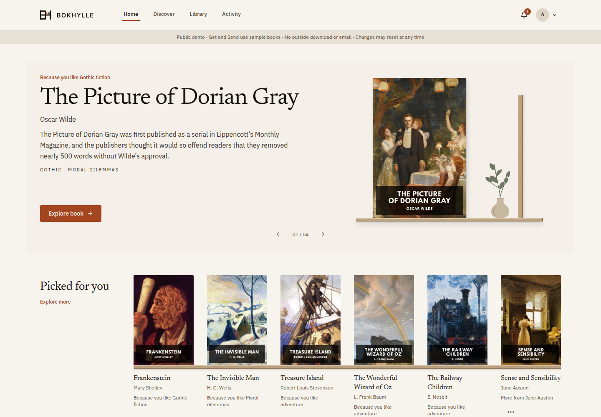

</details>

<details>
<summary>Metadata corrections preview</summary>


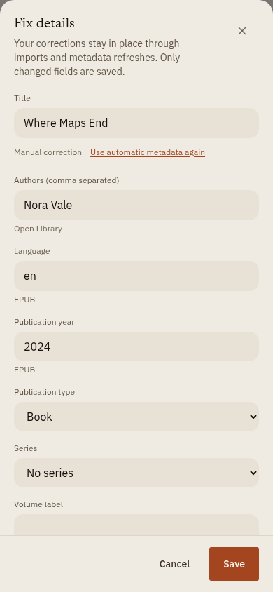

</details>

## How it works

One Rust server serves the web app and uses SQLite for metadata and user state; books remain in your configured library directory. You can start with local EPUB, PDF, or CBZ files alone.

Home suggestions follow each profile's shelves and interests. Household books
stay available through deliberate browsing and search. Administrators can correct
book metadata without a later refresh undoing their edits; **Fix details** shows
field origins and offers an explicit return to automatic metadata.

Open Library supplies catalogue metadata. Adults can add a direct EPUB, PDF, or CBZ download link to a known book, or browse OPDS 1.x and 2.0 feeds configured by an administrator. An optional watch folder imports local EPUB, PDF, and CBZ files. Prowlarr or Torznab can find torrent releases for qBittorrent; Newznab can find Usenet releases for SABnzbd. Downloaded ZIP and RAR archives can be inspected for EPUB, PDF, and CBZ files. Configure only sources you are permitted to access.

A compatible assistant can use the Model Context Protocol (MCP) integration for selected library and request actions. Its token is tied to a profile and follows that profile's permissions. See [Getting started](docs/getting-started.md#readers-and-assistants) for reader and assistant setup.

## Start with Docker Compose

You need Docker with the Compose plugin and a Unix-style shell. Start with a fresh config directory; existing book files can be scanned into it. To start a new installation:

```sh
git clone https://github.com/alexpalexpinne/bokhylle.git
cd bokhylle
cp .env.example .env
mkdir -p data/config data/library data/downloads
printf '\nBOKHYLLE_UID=%s\nBOKHYLLE_GID=%s\n' "$(id -u)" "$(id -g)" >> .env
chmod 600 .env
chmod 700 data/config
```

Set a unique `BOKHYLLE_ADMIN_PASSWORD` of at least eight characters in `.env`. The first administrator is created only while the database has no users. The commands above use your current non-root user's UID/GID so the container can write the mounted directories. If you use a different owner, set `BOKHYLLE_UID` and `BOKHYLLE_GID` in `.env` to match. The example pins the published image to `v0.1.0`. Then start the app:

```sh
docker compose -f compose.yaml -f compose.image.yaml pull bokhylle
docker compose -f compose.yaml -f compose.image.yaml up -d --no-build bokhylle
```

Open [localhost:8080](http://localhost:8080) on the host, sign in as the administrator, place EPUB, PDF, or CBZ files in `data/library`, and run **Scan library** from Settings → Library. You can add the optional acquisition services later.

The Compose defaults are intended for a trusted local network. For access outside your LAN, use an HTTPS reverse proxy and set `BOKHYLLE_SECURE_COOKIES=true`. See [Getting started](docs/getting-started.md) for volume permissions, integrations, and network setup, and [Operations](docs/operations.md) for backups, restores, and updates. The [documentation index](docs/README.md) links the other guides.

To build from source, use `docker compose up -d --build`. For image updates, follow [the image overlay instructions](docs/operations.md#published-image). Optional Jackett and SABnzbd examples are in [Getting started](docs/getting-started.md#optional-jackett-and-sabnzbd-containers).

## Project status

Bokhylle is a **public beta**. Automated Rust and Chromium tests cover core flows, including a synthetic backup restore and accessibility checks. Test restores with your own config and library before relying on backups. Live Newznab/SABnzbd service compatibility, real reader and assistant clients, Firefox, Safari, screen readers, and more NAS setups still need hands-on validation. See [current limits](docs/getting-started.md#current-limits).

## Build and contribute

Development requires stable Rust with edition 2024 support, Node.js 24, pnpm 10, and make:

```sh
pnpm -C frontend install --frozen-lockfile
make check
```

The [contributing guide](CONTRIBUTING.md) covers local development, tests, and contribution licensing. [AGENTS.md](AGENTS.md) records the current architecture and important invariants; the [design principles](docs/design-principles.md) guide UI changes. Report vulnerabilities through [the security policy](SECURITY.md).

The HTTP JSON API has an [OpenAPI 3.1 contract](openapi.json), also served by each instance at `/openapi.json`. See [API contract notes](docs/api.md) for authentication, generated types, and coverage.

Bokhylle's own source is licensed under [AGPL-3.0-only](LICENSE). This includes the network source-availability requirement for modified versions. Third-party dependencies and fonts keep their own licenses; see the [third-party notices](docs/third-party/README.md).

Contributions use the same AGPL-3.0-only license, and contributors retain their copyright. No separate agreement or signature is required; see [CONTRIBUTING.md](CONTRIBUTING.md).

Copyright © 2026 Bokhylle contributors.
