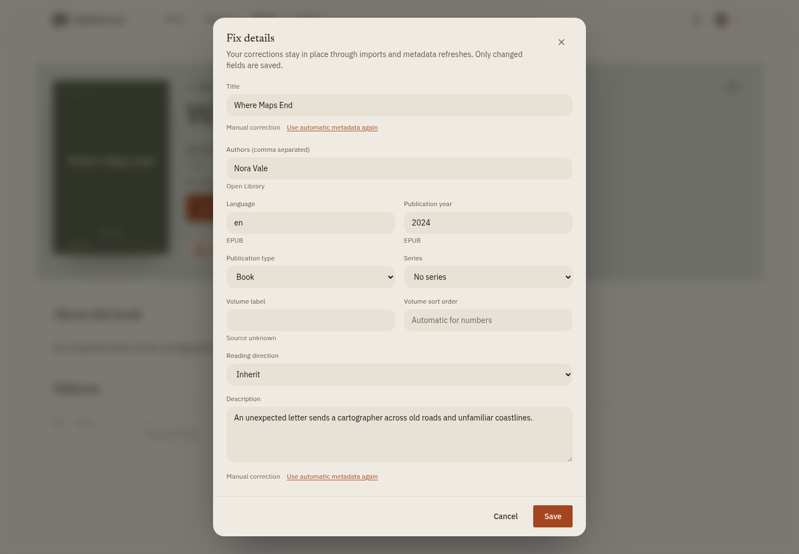
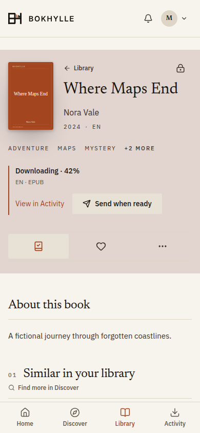
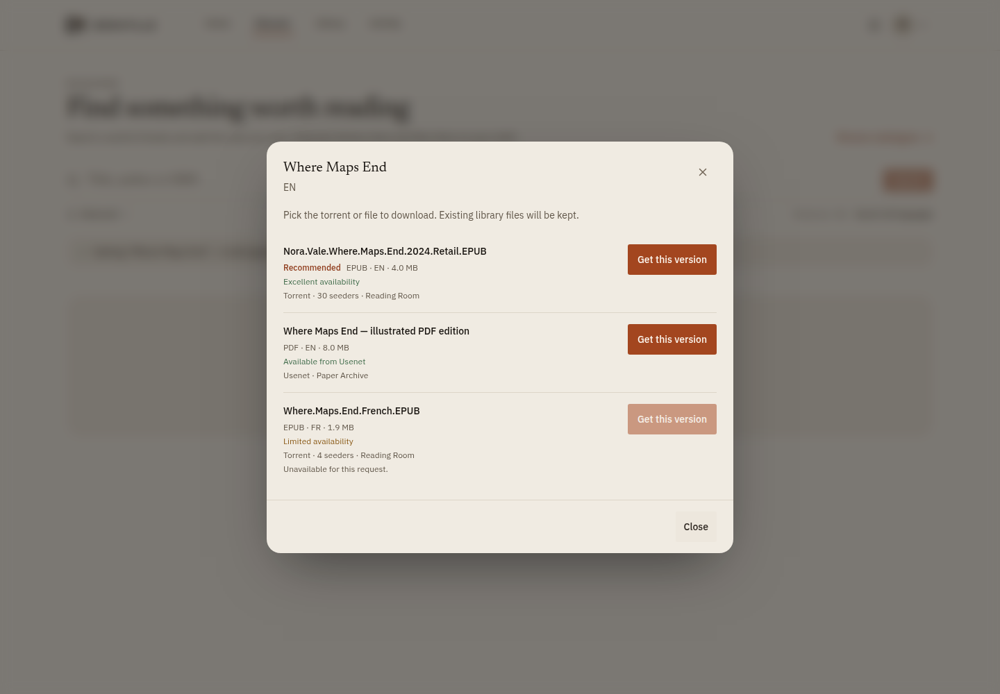
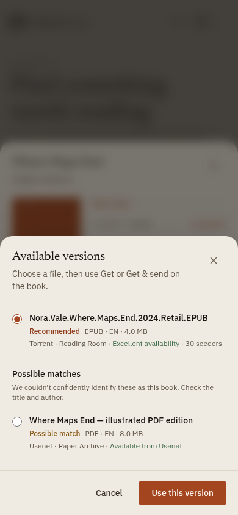

# Getting started

## Prepare the host

Start the first release with a fresh config directory. Development databases
are incompatible with the release baseline; see [database compatibility](operations.md#database-compatibility).
Existing EPUB, PDF, and CBZ files can be scanned into the new installation.

Install Docker with the Compose plugin. Clone this repository, copy `.env.example` to `.env`, and set a unique `BOKHYLLE_ADMIN_PASSWORD` of at least eight characters. The default administrator username is `admin`; change `BOKHYLLE_ADMIN_USERNAME` before the first start if desired. These bootstrap credentials are used only while the users table is empty.

Create `data/config`, `data/library`, and `data/downloads`. They are bind-mounted into the container and must be readable and writable by its user. The commands below set `BOKHYLLE_UID` and `BOKHYLLE_GID` to your current non-root user's IDs. If you use a different owner, set those values to match. Protect `.env` and `data/config` from other users on the host.

```sh
cp .env.example .env
mkdir -p data/config data/library data/downloads
printf '\nBOKHYLLE_UID=%s\nBOKHYLLE_GID=%s\n' "$(id -u)" "$(id -g)" >> .env
chmod 600 .env
chmod 700 data/config
docker compose -f compose.yaml -f compose.image.yaml pull bokhylle
docker compose -f compose.yaml -f compose.image.yaml up -d --no-build bokhylle
```

The image includes the server and built web app. `.env.example` pins `BOKHYLLE_IMAGE` to the release version; use an available tag or digest from GHCR. For a source build, use `docker compose up -d --build` instead. When the container is healthy, visit `http://localhost:8080` (or the `BOKHYLLE_PORT` set in `.env`). If startup fails, check `docker compose logs bokhylle` and the host directory permissions.

## Sign in

Choose your picture or name on **Who’s reading?**, then enter your PIN or
password. Profiles sit side by side and wrap on smaller screens; selecting one
shows just that profile and opens its sign-in panel without asking you to type
a username. **Back to profiles** returns to the chooser. **Sign in another way**
opens the username form if you need it. **Remember this device** keeps
the session across browser restarts until it expires or is revoked.

The other profiles fade away, your profile slides into the centre, and then
the sign-in panel opens below it. On touch screens the keyboard opens from the
original profile tap; once the panel has opened, the page scrolls smoothly to
keep the credential controls visible. Reduced motion skips these animations.

Names and small profile pictures are visible before sign-in. Adults can change
their picture from Profile; children use My settings. Missing or unreadable
pictures show an initial. Disabled accounts do not appear. Selecting a profile
still requires its credential; an existing authenticated session opens the app
directly.

## Add books

Put EPUB, PDF, or CBZ files under `data/library`, then run **Scan library** in Settings → Library. Scans extract title, author, and other available metadata. The books stay in the mounted library directory; the catalogue and account data live in `data/config/bokhylle.db`. CBZ metadata comes from filenames. After a scan, an administrator can open **Library → Review imports** to check suggested publication types and series grouping. Acquired CBZ files may also require the separate acquisition import review because a filename alone does not meet the automatic selection threshold.

During onboarding, each adult chooses language and format preferences. These preferences guide discovery and acquisition. An adult can add an existing shared book to their private shelf without copying the file. Only administrators browse and assign child shelves; other adult shelves remain private, even from administrators in the app. In Settings → Household, an administrator can turn off **Can add books to the shared library** for an adult account. That reader can still use existing books and ask an administrator to approve new ones.

### Private and shared books

Each adult chooses a **Default for new books** in **Profile → Reading preferences → New book sharing**. The initial default is **Shared with the household**. Discover, direct file imports, and catalogue downloads use that saved preference. Before adding a book, Discover shows a read-only lock or household icon beside the dialog's Close control, with a tooltip describing the saved default. Change the default in your profile, or change an acquired book's sharing from its book page. The choice is saved before background work starts; changing the account default does not change earlier books or active requests.

The book page shows a lock for **Private**, or a household icon for **Shared with household**, at the top right of its header, aligned with the Library back link, with a tooltip and accessible label. On a book you acquired, select this icon to open sharing settings and save your choice. Borrowed books show a read-only icon. The marker reports actual household visibility: another owner's shared choice can keep a book shared even when your addition is private. For several books, open **Library → My shelf → More → Change sharing for several books**, select books you acquired, and choose **Make private** or **Share with household**. Shared books borrowed from another person cannot be selected. This works for EPUB, PDF, and CBZ, including individual comic volumes.

A private book is visible to its owners and explicitly assigned child profiles; shared books are available to other adults. Personal shelves, likes, and reading progress stay private with either setting. Adding another person’s shared book to your shelf is borrowing: it gives you no ownership or sharing controls. If its owner makes it private, it disappears from your browsing and reader access. If two people independently acquire the same title, both keep their ownership and access to the stored file. Each changes only their own sharing: if either owner shares the book, it remains available in the household collection. Removing a book from a personal shelf keeps any independently acquired ownership and sharing choice. Children still see only assigned books; administrators can manage their access.

Existing owner sharing choices are preserved when upgrading. Historical, unmanaged library imports stay shared. Books scanned directly into the household library remain shared household imports. Shelf membership alone does not claim them. Acquisition history identifies existing owners when upgrading; a managed book without acquisition history keeps the earliest known adult as its owner. Privacy applies to the app, downloads, browser readers, OPDS, KOReader sync, and assistant access. The server administrator still operates the filesystem, backups, and administrative import/acquisition tools.

To remove a book from your personal shelf, open its book page and toggle **On my shelf**. On mobile, this control shows a book icon with a check mark. File access and sharing remain unchanged. A downloaded book page gives **Read in Bokhylle** and **Send to my reader** equal emphasis, alongside a file picker when there are several versions. Subjects stay in the header below the author and metadata, using the small uppercase catalogue labels. On mobile, they span the full header width. Select **+N more** to expand the list, or **Fewer subjects** to collapse it. Shelf, Like and More sit underneath the reading actions. Mobile spreads these icons across three equal-width cells; desktop keeps the controls together with text labels. **More** opens a desktop popover or mobile sheet containing **Download**, collections, other versions and occasional management actions. To remove a book and its files for everyone, an administrator chooses **More → Delete book**.

Library shows **All** and adds **Books** or **Comics & Manga** when the
selected shelf or household scope contains that kind of publication. The latter
view groups volumes by local series; ungrouped comics remain individual books.
Search still reaches individual volumes. An administrator can use **Fix details**
on a volume to set its publication type, choose or create a local series, enter
a volume label and numeric sort order, or unlink it. Imported series text stays
available in Fix details after a correction. Magazines and catalogues can be
classified now, but do not yet have dedicated browsing views.

**Fix details** also shows where metadata came from. Only fields you change
become manual corrections; those corrections survive refreshes, imports, and
rescans, even when you deliberately clear a description or author list. Choose
**Use automatic metadata again** beside a corrected field, then Save, to restore
its saved automatic value. Older metadata with no recorded origin is shown as
**Source unknown**.



Open a series to see your current volume and mark volumes finished or
unfinished. The reader's **Display → Mark finished** does the same thing.
Opening a volume alone does not finish it. After a finished regular volume,
the series page offers the next number when exactly one copy is present;
missing or ambiguous numbers do not produce a next-volume link. Progress is
personal to the signed-in profile and survives replacement of a book file.

After scanning or importing files, open **Library → Review imports** as an
administrator. Bokhylle suggests a publication type and, when it finds an
explicit volume marker or embedded series metadata, a series and volume.
Review each suggestion before accepting it. **Review details** lets you adjust
the type, local series, volume, sort order, and reading direction. The page
shows counts for suggested books, comics, and manga. **Straightforward** means
a suggested book without a series clue; comics, manga, and series clues appear
under **Closer look**. You can filter a group, select its files across pages,
then preview every proposed change before confirming up to 1,000 files in one
batch. Narrow a filter when it contains more than 1,000 files. Dismissing only
removes a file from the pending queue; it does not change its metadata.
**All files** lets you revisit a decision. Accepted corrections remain in place
on later scans. The review queue for library classification is separate from
the acquisition import review for downloaded files.

## Discover and personalise

The first Home recommendations can come from genres, liked books, and followed authors chosen during onboarding, before any files are acquired. The **Picked for you** row suggests catalogue books; library rows fill as EPUB or PDF files are added. Search results use every language listed for a work when matching your preferred languages. An individual edition's language is confirmed when a copy is acquired.

After the setup wizard, Home shows a loading message and placeholder shelves while it gathers the first books and suggestions. If there are no books or suggestions yet, it then shows the empty-library guidance.

Household books appear in your recommendations only when they have a personal
reason to be there, such as a selected interest or an author you follow. Another
profile's collection does not automatically become your taste. If your shelf is
empty, choose reading interests or browse **Household** to select existing books.
Your deliberate household searches still include books outside your shelf.

Home shows a book spotlight, **Picked for you**, **From authors you follow**, **Continue reading**, **Recently Added**, **Rediscover your library**, subject rows, **Because you requested…**, **Based on books you liked**, collections, and authors when there is content for them. Subject and taste rows use books already in the library; **Picked for you** can suggest books from the catalogue. The hero uses familiar wording such as **Staff picks**, without the catalogue provider's name.

Home opens with local books and saved suggestions while catalogue recommendations
refresh in the background. New picks are used on your next Home visit, so shelves
stay in place while you browse. A recent profile snapshot also survives page
reloads within the same browser tab; signing out clears that tab's snapshot.

Picked for you uses the overall taste profile: selected interests, likes,
requests, successful reader sends, deliberate shelf additions, and followed
authors. Marking a book finished adds no recommendation weight, but its
existing taste signals remain. Local personalised rails need at least three
suitable books; Continue reading and other shelf rows can show fewer.

You can download an available EPUB, PDF, or CBZ repeatedly without adding another library copy or changing shelf membership. **Get** shares an active acquisition for the same book and accepted-language variant. The finished file enters the library once, while each requester gains a personal shelf entry with their chosen sharing setting. Children receive only books an administrator assigns or approves.

### Books being downloaded

Opening a pending book shows whether Bokhylle is finding a file, waiting for a version choice, queued, downloading, importing or waiting for review. Download progress comes from the download client. **View in Activity** opens the full details; the requester or an administrator can select a version or retry failed work.

A requester can use **Send when ready** to choose a reader before the file arrives. The page shows the scheduled address. Select that line to change the reader or cancel the scheduled send. The selected address is saved, so changing a default reader does not redirect this send. Earlier **Get & Send** requests continue to use the default reader until you choose a destination.

If another version is being downloaded, an existing file remains available through **Read in Bokhylle** and **Send to my reader**.



### Choose a download version

Adults allowed to get books use the same version chooser as administrators.
In **Profile → Reading preferences → Download selection**, choose **Let Bokhylle
choose** or **Show available versions**. The normal **Get** action follows this
account preference. Automatic selection uses your language and format preferences
and only asks if it cannot choose confidently. Show available versions keeps you
in the book dialog while the search finishes, then proposes one confidently
matched version with its filename, format, language, size, source and availability.
Use **Change version** to compare alternatives in a dialog on desktop or a scrolling
sheet on mobile. **Use this version** returns to the book; **Get** or **Get & send**
starts the download. Cancelling keeps your previous choice. If the identity is
uncertain, **Review possible matches** requires a deliberate choice and Get waits
for that review. With no suitable results, the book says **No matching version
found**. Activity tracks the subsequent download and can resume a pending choice.

Version matching compares normalized titles and authors, including apostrophes
and accented names. Release decorations such as a trailing year, retail and
format tags, bracketed series labels, or an uploader group attached to an
EPUB/eBook tag are not part of the book title. Subtitle punctuation and
author-last filenames are supported. A different author, title or explicit
volume still excludes a result. Numbered packs and ambiguous series suffixes
require review rather than becoming automatic recommendations. A year in
another book's filename does not qualify as a match for a numeric title such
as *1984*; missing identity or format evidence also requires review.

Words within the matched title or author are not language or file-format tags:
*Norwegian Wood* is not automatically Norwegian, and a title containing “EPUB”
still needs a separate format tag. Explicit release tags remain authoritative.
Padded volume numbers such as `03` and `3` match, but conflicting volume labels
exclude a release. Summaries, study guides and workbooks are distinct from the
original book unless you requested that specific work.





For a downloaded book, use **More → Find another version** to deliberately open
the same chooser for an additional file. The new
file is added alongside existing files; existing reading progress stays with
the original file. Downloading identical bytes reuses the existing file.
If someone already started an acquisition for the same book and language
variant, you join that work with its original choice. Its requester or an
administrator controls the selection. Adults who need approval request a
book through the existing approval flow.


Author pages can show a short biography and dates from Open Library when the author has a known Open Library ID or an exact name match can be resolved. The source is linked on the page. These optional details are cached and may be absent; the local books and follow controls remain available if Open Library is slow or unavailable. Child profiles cannot open author pages.

Adults can personalise Home under Profile → Appearance: choose a shelf finish,
show or hide the featured shelf's vase, and enable or disable automatic
Spotlight rotation. These choices are saved with the profile across devices.
Paper/Ink remains a device choice in the account menu. Spotlight uses manual
navigation for children, shared demo profiles and devices requesting reduced
motion. Continue reading appears when a profile has unfinished browser or
KOReader progress.

## Optional acquisition services

The library works without Prowlarr or qBittorrent. An administrator can open **Discover → Browse catalogues** and add an OPDS 1.x or 2.0 feed URL. Adults can browse its sections and use a direct EPUB, PDF, or CBZ acquisition link to add a book. Project Gutenberg's OPDS feed is `https://www.gutenberg.org/ebooks/search.opds/`. An adult allowed to add books can also open a known book and choose **More → Import from URL** for a direct HTTP(S) file URL, rather than a webpage or torrent URL. Select the format when the URL has no `.epub`, `.pdf`, or `.cbz` extension.

OPDS feed access in this version does not accept catalogue credentials. Bokhylle offers direct file links from a feed; borrow, buy, preview, and subscription links are not imported. Public HTTP(S) download URLs must resolve to public addresses. The administrator-configured OPDS origin may be on the private network; links that leave it must resolve publicly. Downloads are capped at 512 MiB, checked against the selected file format, and then use the normal import and review path. A failed direct link can be retried manually from Activity; it is not scheduled for weeks of automatic searches.

To start the sample Prowlarr and qBittorrent integrations included in Compose:

```sh
docker compose --profile integrations up -d
```

Open Settings → Getting books as an administrator and configure Prowlarr and qBittorrent. The sample Compose services are reachable from Bokhylle at `http://prowlarr:9696` and `http://qbittorrent:8081`. Their web interfaces are available on the host at `127.0.0.1:9696` and `127.0.0.1:8081` by default. To administer them from another device, set `INTEGRATION_WEB_BIND` in `.env` to the host's private LAN address, protect each service's login, and do not forward those ports from your router. qBittorrent uses the same `BOKHYLLE_UID` and `BOKHYLLE_GID` as Bokhylle so both can access `data/downloads`. Use **Check now** on Getting books to verify the connections, download path, library writability, and hardlink support.

For Jackett or another Torznab-compatible source, configure **Torznab** instead of Prowlarr. Enter its Torznab API endpoint and API key in separate fields; the endpoint must not contain `apikey`, `t`, `q`, or `cat` parameters. The default category is `7000` (books). Change it to the source's book categories, or leave it empty to search all categories. Set **Active source** to Torznab; Automatic keeps Prowlarr in use when both are configured and otherwise uses Torznab. qBittorrent is still required for torrent retrieval. You can test each configured search source separately.

For Usenet, configure a **Newznab** API endpoint and key, then configure **SABnzbd** with its API endpoint, full API key, and a category such as `books-app`. Choose Newznab as **Active source**, or use Automatic when neither Prowlarr nor Torznab is configured. Newznab results are handed to SABnzbd using its NZB URL; Bokhylle does not connect to a news server itself. SABnzbd's completed folder must be mounted at the same path inside Bokhylle's configured downloads directory (normally `/downloads`). The optional `compose.integrations.yaml` overlay includes SABnzbd and Jackett examples; connect an existing service or follow the overlay instructions below. Use the separate connection tests in Settings to check both services.

To import files dropped on disk, enable **Watch an import folder** under Settings → Getting books → Imports. The default folder is `ingest` inside Bokhylle's config directory (`/config/ingest` in the container); you can set another absolute path that is visible and writable inside the server. Files must be complete, at least 30 seconds old, and directly in that folder. EPUB, PDF, and CBZ are supported; archives and subfolders are ignored. The watcher copies and validates each file, places it in the library, and removes the source only after a successful import or a digest match with an existing library file. Invalid publications are moved to the folder's `review` subfolder. A journal resumes interrupted placement and cleanup on restart. The Import folder status panel shows retained work and review files. If using Docker, put files under the host's `${CONFIG_DIR:-./data/config}/ingest` or mount a separate host folder and set the watch path to its container location.

If you use an existing download client, its completed files must be visible inside the Bokhylle container under `/downloads`. Configure the client's reported path to match that mount; a path that only exists on the host cannot be imported. Imports default to hardlinking so completed torrents can remain available for seeding. Copy and move are configurable alternatives. EPUB, PDF, and CBZ content can be imported, including when wrapped in ZIP or RAR archives. CBZ pages and archives have additional size and entry limits.

Release search accepts a result that includes EPUB, PDF, or CBZ alongside other formats. It rejects unrelated titles, clear author or volume conflicts, and releases larger than 1 GB. Recommendations and automatic downloads need a strong title and author match, or the exact requested ISBN in the release name. Missing or partial identity remains a possible match requiring deliberate review, even when only one result exists. Collections also require review. Rejected results are omitted from normal choices and remain available in administrator diagnostics. The size limit applies to the whole release, including archives.

## Notifications

Select a message under the bell to open its book, request, or download. Ready
books and successful sends open the book page. Approval and decline messages
open the matching request; download failures open the matching item in Activity.
**Choose a version** opens that download's version chooser. The panel closes
after selecting a message. Children open their own requests or assigned books.
Administrators can also select a pending request's cover or title to open it,
or use the separate Approve and Decline buttons in the panel.

## Readers and assistants

Open an EPUB, PDF, or CBZ and choose **Read in Bokhylle**. The reader saves the
position for that exact file to your profile, so it can resume on another
signed-in browser. EPUB has contents, search, and Display controls for reading
colors (Follow app, Paper, Warm, or Ink), Georgia or sans serif text, text size
from 80% to 200%, and line spacing. Appearance is saved per profile in the
current browser, so it can differ between devices; saved reading positions still
sync across browsers. Follow app uses Bokhylle's resolved Paper or Ink appearance.
PDF and CBZ can change the surrounding reader surface without changing page
contents. PDF has page navigation, text selection and search, fit and zoom. The
PDF reader prepares nearby pages in the background when memory allows; a scanned page can still take
time to open the first time. CBZ has page
navigation, fit, and double spreads. For EPUB, PDF, and CBZ, **Display → Reading
direction** controls page buttons, arrow keys, and swipes. It also controls CBZ
spread order and EPUB page flow. It is saved per profile and book, including for
children. An administrator can set an explicit direction in **Fix details** or
choose **Inherit**. A series can also provide a default. When nothing is set,
EPUB uses its embedded page progression direction, followed by left to right.
Choosing **Inherit** in the reader clears the personal override.
Long contents and search lists scroll inside their panels. Browser reading
requires a network connection.

Children can open only files on their assigned shelf. **Continue reading**
shows progress for the position Bokhylle will open. PDF and CBZ share exact
page positions with KOReader when both use the same file. EPUB uses a CFI to
XPointer conversion; malformed markup or an unresolvable locator keeps browser
progress separate rather than guessing by percentage. EPUB handoff has been
checked in both directions with desktop KOReader on fictional books; complex
EPUBs and physical devices still need validation.

Configure SMTP in Settings → Delivery if you want email delivery. Adults add a Kindle, PocketBook, or other email-capable reader destination in Profile. For a child, an administrator opens Settings → Household → Readers beside that child and adds the destination there. The administrator's default Kindle address is only a household fallback. Adults create OPDS and KOReader tokens in Profile; an administrator creates a child's tokens on the same Household reader page. Tokens are shown only once. Assistant access uses separate agent tokens.

Adults can change their profile picture from Profile; children can do so from My settings. Both offer ten Bokhylle profile marks: fox, owl, cat, bear, whale, book, tree, mountain, moon, and leaf. Initials remain the default; no mark is assigned automatically. An administrator can optionally choose a mark when creating or editing any household account. Marks are the same for adults and children. A personal photo takes precedence, and removing it restores the chosen mark or initials. Either page also accepts a PNG, JPEG, or WebP image up to 1 MB by choosing or dragging it in. My settings also lets a child choose the Paper/Ink app theme and EPUB text size for the current browser. The account menu has an in-app Help page for finding books, understanding personal and household shelves, and setting up readers. Profile Overview shows personal shelf, followed-author, liked-book, and sent-book counts. Sent books are distinct books successfully delivered by that profile; repeat sends of one book count once. Reader setup has one Add reader action beside My readers when readers exist, or inside the empty state when none exist. If a page's assets change while Bokhylle is open, the app refreshes once to load the new build and shows a recovery page if loading still fails.

## Connect an assistant with MCP

Bokhylle exposes a Model Context Protocol (MCP) server at `/mcp`. Use an
assistant client that supports Streamable HTTP with bearer-token authentication.
To connect an adult profile:

1. Open **Profile → Integrations**, name the connection under **AI & integrations**, and choose
   **Read only** or **Read & write**, then select **Create token**.
2. Copy the token while it is displayed; it is shown only once.
3. Add your instance's MCP URL (for example, `https://books.example.com/mcp`)
   to your assistant client and supply the token as its bearer credential.

Read-only connections can search the library or public catalogue, inspect books
and reading progress, list the profile's shelf, and view requests. Read & write
connections can also get or request books and send available books to a
configured reader. Acquisition and delivery need the same configured sources
and reader setup as the web app. Every tool follows the token's profile
permissions, including child shelf restrictions and request approval. Revoke a
connection from **AI & integrations** when you no longer use it. The public
demo disables MCP.

For client integrations, `search_books` with `scope: "catalogue"` returns
`provider` and `providerKey` values that `add_catalogue_book` can use to start
an acquisition for an adult profile allowed to add shared books. Existing local
books use `add_book` with `bookId`. Child profiles and adults without acquisition
permission can use `request_book` for a catalogue result; administrators decide
those requests. `add_catalogue_book` accepts optional `preferredFormat`,
`preferredLanguage`, and `sendToReader` values. Its response includes `bookId`,
acquisition `id`, `status`, and `duplicate`. These actions require a write-enabled
agent token.

## Child profiles

Under Settings → Household users, choose **How can this child find new books?**

| Mode | Child experience |
| --- | --- |
| **Assigned books only** | Read books an administrator puts on their shelf. |
| **Search and ask** (default) | Search Requests by title, author or ISBN, see basic matches, and ask an adult for a book. |
| **Explore and ask** | Also use Discover, book details and descriptions, and suggestions on Home. |

Both search modes use the public catalogue, which is **not age filtered**.
Neither exposes unassigned household books or allows a child to acquire,
download, or send files themselves. Requests always require administrator approval.
An existing profile that allows exploration without requests is shown as
**Explore only (existing setting)**. Editing other details preserves it;
choose a mode explicitly to change that access.

When adding a child, choose **starting books** from the household library
before creating the account. Search and select multiple books; only the chosen
books enter their shelf. Account settings and initial assignments save together,
so an assignment failure does not leave a partly created account. If there are
no books to assign yet, explicitly choose **Set up books later** to create an
empty shelf. Import books and assign them from **Manage access** on a book page
before the child starts reading. The **Shelf** link beside a child opens their
assigned books for the administrator to review.

The child's welcome wizard explains their access, lets them like assigned books,
and asks about reading interests. An empty shelf skips the favourites step;
failed loads show an error and retry action. The final step offers Requests or
Discover when allowed. **Restart setup** preserves saved likes and preloads
interests; skipping setup does not replace those interests.

Adult and child interest pickers include searchable genre and subject suggestions
and an **Add** action for a custom topic. Choose up to 24 interests, with topics
limited to 60 normalized UTF-8 bytes. Put favourite topics first: suggestions can
give earlier choices more weight. Spelling aliases such as Humour/Humor select
the same suggestion, but custom topics are not automatically matched to every
synonym used by metadata providers. Reading interests do not grant book access
or provide age filtering.

Before approving a child's request, configure SMTP and either a reader
destination under Settings → Household → Readers for that child or the household
Kindle fallback in Settings → Delivery. Approval uses the child's reading preferences: an existing suitable
household copy is sent immediately, while a missing book is acquired and sent
when ready. The book also appears on the child's shelf. Send failures are
reported in the child's notifications; an administrator can retry a recorded
failed send from Delivery history after fixing the settings.

After a child asks for a book, the action changes to **Requested** on the current page and the request appears under **Your requests**. That list shows whether it is waiting for approval, being acquired, ready, or declined.

## Network access

The sample Compose file publishes HTTP on the host and is for a trusted local network. The unauthenticated profile picker shows member names and small profile pictures; its API also includes account names, roles, and credential types. For internet access, put Bokhylle behind an HTTPS reverse proxy, set `BOKHYLLE_SECURE_COOKIES=true`, and set `BOKHYLLE_TRUSTED_PROXY=true` only if that proxy is controlled by you and removes untrusted forwarding headers. Keep the Prowlarr and qBittorrent web interfaces private.

Environment variables take precedence over saved settings. Paths are resolved when the server starts, so restart the container after changing path settings. See [.env.example](../.env.example) for the first-run values and [Security](../SECURITY.md) for the deployment boundary.

## Current limits

- EPUB, PDF, and CBZ are the supported library formats. CBR and CB7 are not supported.
- The built-in browser reader needs a network connection. Image-only PDF scans cannot be text searched without OCR.
- Indexer-based automatic acquisition depends on a configured source and compatible client: Prowlarr/Torznab with qBittorrent, or Newznab with SABnzbd. Available releases and matching download paths are still required; a result can require human review. Direct HTTP, OPDS, and watch-folder imports work without those services.
- Browser automation currently runs in Chromium. Firefox, Safari, screen readers, and physical devices need further hands-on testing.
- OPDS, KOReader sync, and MCP have automated integration coverage. Desktop KOReader EPUB handoff has also been checked with fictional books; compatibility across other clients and physical devices still needs validation.
- RAR archive inspection uses the MIT/Apache-2.0 licensed `rars` crate; see the [third-party notices](third-party/README.md).

## Optional Jackett and SABnzbd containers

The example overlay leaves both services disabled until their profiles are selected.
Start only the services you need:

```sh
docker compose -f compose.yaml -f compose.image.yaml -f compose.integrations.yaml --profile torznab up -d --no-build jackett
docker compose -f compose.yaml -f compose.image.yaml -f compose.integrations.yaml --profile usenet up -d --no-build sabnzbd
```

Jackett's UI is on loopback port 9117. Copy its Torznab endpoint and API key into
Settings, replacing the copied localhost host with `jackett:9117` for the app's
container. SABnzbd's UI is on loopback port 8082; configure your news server there,
set completed and incomplete downloads beneath `/downloads`, and add a `books-app`
category. Configure Bokhylle with `http://sabnzbd:8080/api` and SABnzbd's full API key.
Both applications use the same UID/GID as Bokhylle, and SABnzbd shares its downloads
mount. Select Newznab as the active source when using Usenet.

These are optional examples using upstream images. For reproducible service updates,
set `JACKETT_IMAGE` and `SABNZBD_IMAGE` to tested tags or digests. See the upstream
[Jackett container](https://docs.linuxserver.io/images/docker-jackett/) and
[SABnzbd container](https://docs.linuxserver.io/images/docker-sabnzbd/) instructions.
Live news-server compatibility and device delivery remain hands-on validation tasks;
the release's automated tests use isolated providers and fictional publications.
