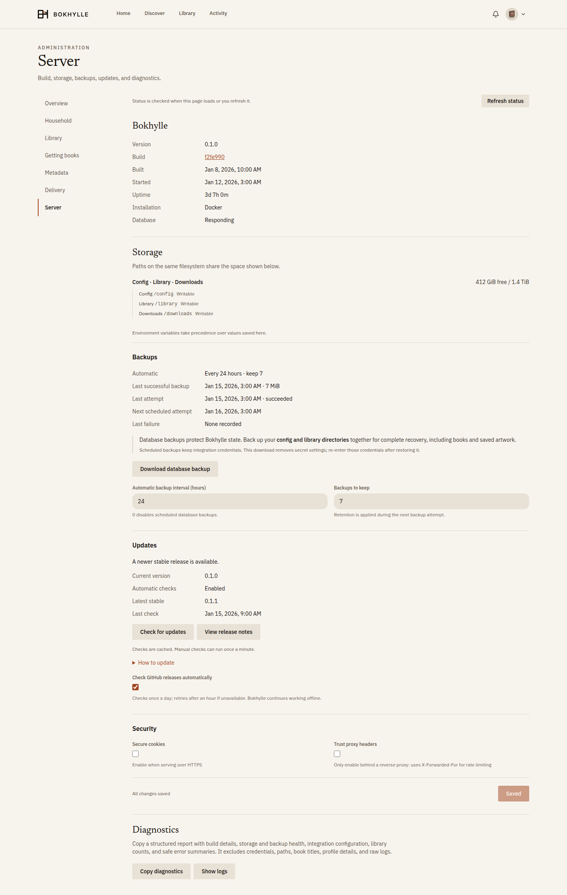

# Operations

## Database compatibility

Bokhylle 0.1.0 starts with one initial migration, `migrations/0001_initial.sql`.
Use a fresh config directory for the first release. Development databases and
backups are incompatible with this baseline; keep them with their development
version. Existing library EPUB, PDF, and CBZ files can be copied into the new
installation and scanned again. Backups created by this release can be restored
with the same release.

Schema changes use new forward-only migrations. Published migration files stay
immutable so existing public installations can upgrade with their accounts,
shelves, and settings intact.

Version 0.2.0 upgrades a 0.1.0 installation in place. Back up config and library
before updating the image. The sharing migration keeps existing books shared;
adults can then choose their default and change individual or selected books.
Personal shelves and reading positions stay private, and other owners retain
their access when someone makes their copy private.

Version 0.3.0 upgrades 0.1.0 and 0.2.0 installations in place. Back up config
and library first. New migrations distinguish acquired ownership from borrowing
and store a reader destination for scheduled sends. Acquisition history preserves
owners; managed books without that history retain the earliest known adult as
owner. A shelf addition alone no longer gives an adult sharing controls or
continued access after the owner makes the book private. Explicit child
assignments and independent owners retain their access. Restore the backup with
the previous image if rolling back; do not run an older image against the migrated
database.

Version 0.3.1 upgrades 0.1.0, 0.2.0, and 0.3.0 installations in place. Back up
config and library first. Migration `0008_catalogue_covers.sql` retains the
catalogue artwork identity when a title becomes a local book, including matching
artwork already present in the metadata cache. Missing automatic covers can be
recovered from the book file or catalogue; manually chosen or cleared covers
remain authoritative. Accounts, shelves, sharing, and scheduled sends are
preserved. To roll back, restore the pre-upgrade backup with the previous image.

## Server administration

Administrators can open **Settings → Server** to see the running version, commit,
build date, start time, and uptime. A source build also reports whether its
working tree had local changes. Missing build metadata is shown as unavailable,
so an unidentified build is not mistaken for a particular release.

Storage reports the space available to Bokhylle for config, library, and downloads,
with paths on the same filesystem grouped into one capacity pool. The check also
creates and removes a small temporary file to test each directory's writability.
Low space means less than 1 GiB available or less than 5% of filesystem capacity.
Host or NAS quotas can impose additional limits; capacity is unavailable on
platforms without the Unix filesystem check. **Refresh status** repeats these
checks and reloads backup and update state.



**Restart required** lists saved startup settings that differ from the values the
running server actually uses: library and downloads paths, metadata and ratings
providers, and the Google Books credential. The notice appears throughout
Settings, clears when the running values are restored or the server restarts,
and respects environment overrides. Backup controls, release-check preferences,
and other settings read during operation do not trigger it. Restart with your
usual service manager; for Compose, use `docker compose restart bokhylle` with
the same Compose files as the installation. Changing mounts or Compose
environment variables requires container recreation with `up -d` instead.

**Copy diagnostics** generates a structured report of build identity, uptime,
database responsiveness, configured integrations, filesystem health, backup
status, library file counts, restart notices, and recent warning/error summaries.
The export uses allowlisted fields: it excludes credentials, paths, URLs, profile
details, book titles, and raw log messages. Error summaries use fixed categories
and the recent-error list is held in memory for this server run. Integration
configuration is not a connectivity test. If clipboard access is unavailable
(for example over plain HTTP), a selectable text area provides the report.
**Show logs** is a separate admin view of raw recent logs; review those before
sharing because they can contain private paths or URLs.

## What to back up

Back up both the library directory and the config directory. The library holds the EPUB, PDF, and CBZ files. The config directory holds `bokhylle.db`, saved artwork, image cache, and `backups/`. The database records users, shelves, requests, integrations, and credentials. Scheduled database backups are stored in `config/backups/` by default, every 24 hours, retaining seven copies; they **contain secrets** and need the same protection as the live database. A library backup is separate: database backups do not contain book files.

Keep `config/artwork/covers` with the config backup: database rows can reference those saved covers. The disposable provider image caches under `config/cache/provider-covers` and `config/cache/authors` can be rebuilt. Provider search and artwork cache behavior is described in [Discovery search and artwork](search-quality.md).

The administrator's backup download at `GET /api/admin/backup` removes secret settings. That copy is suitable for a restore only if you re-enter the missing integration and SMTP credentials afterward. The scheduled backup retains those settings. Do not copy a live SQLite database file without using a SQLite-aware backup method or stopping the server; the database runs in WAL mode.

Every newly created database backup is checked with SQLite's integrity and foreign-key checks before Bokhylle gives it a final backup name or serves it. An interrupted `.partial` file is not a completed backup. This checks the database only; it does not verify that book files or saved covers were copied. The admin download still contains personal data, password hashes, session hashes, and reader/agent token hashes. Treat both backup types as sensitive. Redacting secret settings does not make a downloaded backup safe to publish.

If a crash leaves a `.partial` file in `config/backups` or `config/cache`, treat it as sensitive and remove it after stopping Bokhylle. The scheduler does not count partial files as completed backups.

Set the automatic interval and number of backups to keep in **Settings → Server →
Backups**. The defaults are 24 hours and seven copies; fractional hours are
supported and `0` disables scheduling. Retention applies at the next backup
attempt. The panel shows the last successful snapshot, last attempt and outcome,
next scheduled attempt, and last failure. Attempts and outcomes survive server
restarts. A recorded successful snapshot can be historical if its file has since
been removed; an unavailable backup directory is shown explicitly.

Failed attempts retry after five minutes. If the snapshot succeeded but retention
cleanup failed, the retry cleans up old copies without creating another snapshot
while the existing one is still fresh. An interrupted attempt becomes a visible
failure on restart. Downloaded, redacted database copies are independent of this
schedule and do not replace a full installation backup.

## Make a full, portable backup

For a recoverable copy, keep the config and library directories together at the same point in time. The simplest method is to stop Bokhylle briefly and archive both mounted directories. Put the archive outside the repository so it cannot be added to a commit by mistake. Replace the paths below if `CONFIG_DIR` or `LIBRARY_DIR` is customized:

```sh
bokhylle_backup_dir="$HOME/bokhylle-backups"
mkdir -p "$bokhylle_backup_dir"
chmod 700 "$bokhylle_backup_dir"
docker compose stop bokhylle
tar -czf "$bokhylle_backup_dir/bokhylle-data.tar.gz" data/config data/library
(cd "$bokhylle_backup_dir" && sha256sum bokhylle-data.tar.gz > bokhylle-data.tar.gz.sha256)
docker compose up -d bokhylle
```

Copy the archive and checksum to storage outside this machine, protect them like the live database, and run `sha256sum -c bokhylle-data.tar.gz.sha256` from the destination directory after copying. A checksum detects accidental damage to that copy; it does not replace a test restore. Keep the app version or image tag alongside the backup so you can restore with a compatible version. Large libraries may be better served by a filesystem snapshot or backup tool that preserves the same two directories together.

## Restore a database

These steps are covered by an automated test with a synthetic account, book, file, cover, and scheduled backup. Test them against a copy of your own deployment before relying on them.

1. Stop the Bokhylle container: `docker compose stop bokhylle`.
2. Keep a separate copy of the existing `data/config` and `data/library` directories.
3. Move the old `bokhylle.db` and any `bokhylle.db-wal` and `bokhylle.db-shm` sidecars out of `data/config` into that recovery copy. Do not leave old WAL sidecars beside the restored file.
4. Copy a scheduled backup from `data/config/backups/bokhylle-<timestamp>.db`, or a downloaded backup, to `data/config/bokhylle.db`. Ensure the restored file is writable by the container user.
5. Start the app: `docker compose up -d bokhylle`.
6. Sign in, check a known book and shelf, and run a library scan if the library files came from a different point in time. Re-enter redacted credentials if the source was an admin download.

The restore should use the same compatible Bokhylle version or be tested on a copy before upgrading. Database migrations are forward-only. Keep the prior backup until you have verified the result.

## Update

**Settings → Server → Updates** shows the current version and latest stable
GitHub release, links to release notes, and provides update instructions. Automatic
checks run once a day by default and can be disabled there or with
`BOKHYLLE_UPDATE_CHECKS=false`. Results persist across restarts; failed automatic
checks retry after an hour, and manual checks are limited to once a minute.
Unavailable or offline checks are shown separately from “up to date,” with the
last known release retained. The library works without GitHub access. Only
published stable releases are compared; commits and tags alone are not releases.
Updating and restarting remain installation operations performed outside the app.

Published images embed their commit SHA and build date. Local Compose builds can
embed their source identity by supplying `BOKHYLLE_BUILD_SHA` and
`BOKHYLLE_BUILD_DIRTY` as build arguments through the matching environment
variables. For example, before building:

```sh
export BOKHYLLE_BUILD_SHA="$(git rev-parse HEAD)"
if test -n "$(git status --porcelain)"; then
  export BOKHYLLE_BUILD_DIRTY=true
else
  export BOKHYLLE_BUILD_DIRTY=false
fi
```

Rust source builds detect Git identity directly. Builds without Git or explicit
arguments report unavailable commit metadata. `SOURCE_DATE_EPOCH` can supply a
reproducible build timestamp for Rust builds; the Dockerfile accepts an explicit
Unix timestamp as `BOKHYLLE_BUILD_TIME`.

### Published image

Once a release image is public, set `BOKHYLLE_IMAGE` in `.env` to its version tag
or digest, such as `ghcr.io/alexpalexpinne/bokhylle:v0.3.1`. That tag is
an example; use a tag actually listed on the package. Back up config and library,
then pull and start through the image overlay:

```sh
docker compose -f compose.yaml -f compose.image.yaml pull bokhylle
docker compose -f compose.yaml -f compose.image.yaml up -d --no-build bokhylle
docker compose -f compose.yaml -f compose.image.yaml logs --tail=100 bokhylle
```

Use the same overlay when stopping, inspecting, or updating this installation.
The volume paths and port stay the same as the source-based configuration.

### Source build

For source-based Compose installs, pull the version you intend to run, review changes, back up config and library, then rebuild and restart:

```sh
docker compose up -d --build bokhylle
docker compose logs --tail=100 bokhylle
```

`GET /healthz` checks that the process is alive; `GET /api/health` also checks the database. A Docker build is only the first gate; confirm the running app and sign in after an update. The source-based Compose file builds locally by default. Maintainers can find image release rules in the [publishing guide](publishing.md#publish-docker-images).

## Common checks

- **Book missing from the catalogue:** check file format and permissions, then run Scan library in Settings → Library. Review Library health for missing files or metadata.
- **Acquisition stalled:** inspect Activity and Admin Needs Attention. Use **Check now** in Settings → Getting books for the configured Prowlarr, Torznab, or Newznab source and its qBittorrent or SABnzbd client. Confirm **Active source** points to the intended indexer. A SABnzbd completed path must resolve inside Bokhylle's downloads directory; changing a mount without matching the client's reported path prevents import.
- **SABnzbd submission uncertain:** Bokhylle records each attempt before sending it and looks for its unique name in SABnzbd's queue and history after a timeout or restart. It waits up to ten minutes before reporting an unrecovered submission. Check SABnzbd before using **Try again**; an explicit retry starts a fresh attempt. Cancellation is retried after restart, including jobs already in postprocessing, and leaves completed files under SABnzbd's control.
- **Watch folder file remains:** enable the watcher in Settings → Getting books → Imports, wait 30 seconds after the final write, and check that the server can read the folder. Only top-level EPUB, PDF, and CBZ files are considered. Invalid files move to `review`; the Import folder panel shows pending imports, cleanup, review counts, and the latest placement error. Stale unjournaled watcher staging files are reconciled after one hour. Do not point the folder into the library or downloads tree.
- **Direct link failed:** inspect Activity for the download or import error. The URL must return a supported book file within 512 MiB; a web page, blocked destination, wrong format, or expired link needs a fresh URL. OPDS catalogues are managed from Discover → Browse catalogues.
- **Download not imported:** verify the download client reports a path under the container's `/downloads` mount. Paths outside it are rejected.
- **Integration secret lost after restore:** confirm which backup type was used. Admin downloads intentionally omit secret settings and private NZB submission URLs; scheduled backups preserve them. Reconfigure the integrations after restoring an admin download. Existing SABnzbd jobs can still be recovered by their saved id or name; an unsubmitted NZB needs **Try again** to select a fresh release.
